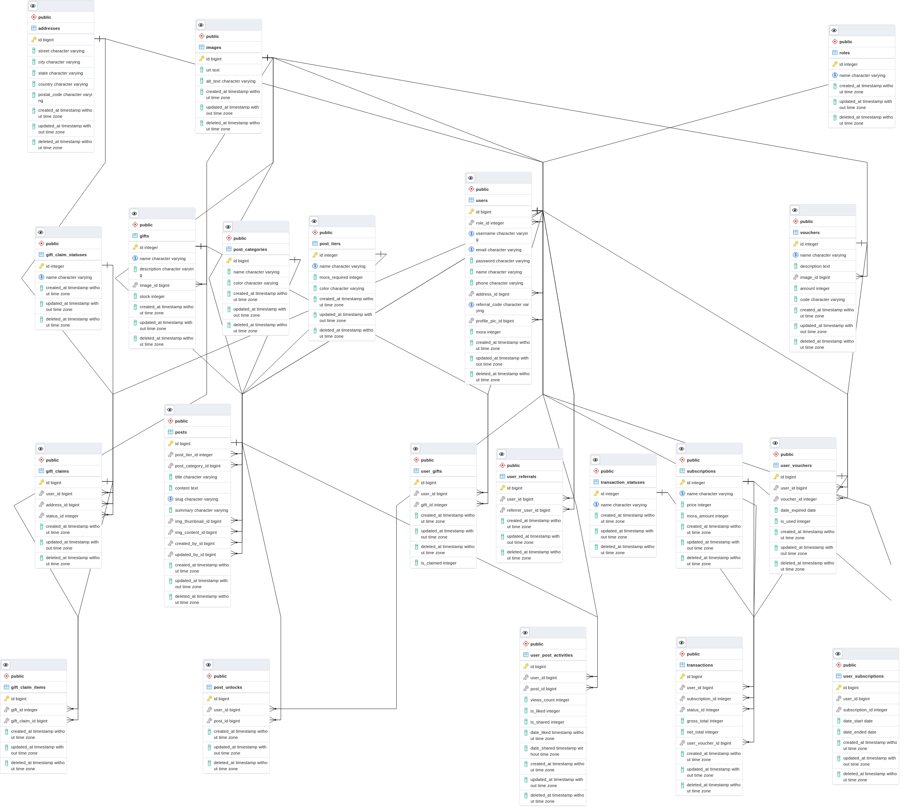

# teyvat-times-go

## About
teyvat-times-go
<br><br>

### Stacks
- Go programming language
- Database: postgresql
- API: Gin
- ORM: Gorm
- Auth: Golang JWT

## How to use this repo
1. Clone the repo
```
git clone https://git.garena.com/sea-labs-id/batch-01/bagus-tambunan/final-project-backend.git
```

2. Open the dir on your terminal
```
cd final-project-backend
```

3. Create database schema and seed data
- Create database "teyvat"
```
createdb -h localhost -p [db-port] -U [db-user] [db-name]
createdb -h localhost -p 5432 -U postgres teyvat
```

- Execute sql file "db/teyvat.sql"
```
psql -h localhost -p [db-port] -U [db-user] [db-name] < [path-to-file/teyvat.sql]
psql -h localhost -p 5432 -U postgres teyvat < db/teyvat.sql
```

4. Change app config
- Open file "config/config.go"
- Set config values
  - App name
  - App port
  - DB host
  - DB port
  - DB user
  - DB password
  - DB name

5. Install Go modules
```
go install
```

6. Start server
```
go run main.go
```

Or via nodemon
```
nodemon --exec go run main.go --signal SIGTERM
```
<br>

## User credentials
```
[ADMIN] Venti
Email: venti@mail.com
Password: venti123
```

```
[ADMIN] Zhongli
Email: zhongli@mail.com
Password: zhongli123
```

```
[ADMIN] Raiden
Email: raiden@mail.com
Password: raiden123
```

```
Klee
Email: klee@mail.com
Password: klee123
```

```
Albdeo
Email: albedo@mail.com
Password: albedo123
```

```
Razor
Email: razor@mail.com
Password: razor123
```

```
Sucrose
Email: sucrose@mail.com
Password: sucrose123
```

```
Mona
Email: mona@mail.com
Password: mona123
```

```
Lisa
Email: lisa@mail.com
Password: lisa123
```

```
Jean
Email: jean@mail.com
Password: jean123
```

## API documentation
```
/docs
```
<br>

## Database design

<br>

## Testing
0%

## Live demo
```
https://teyvat-times-api.herokuapp.com/
```